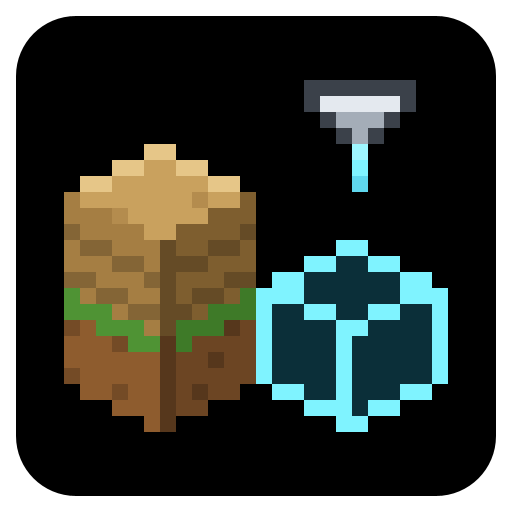
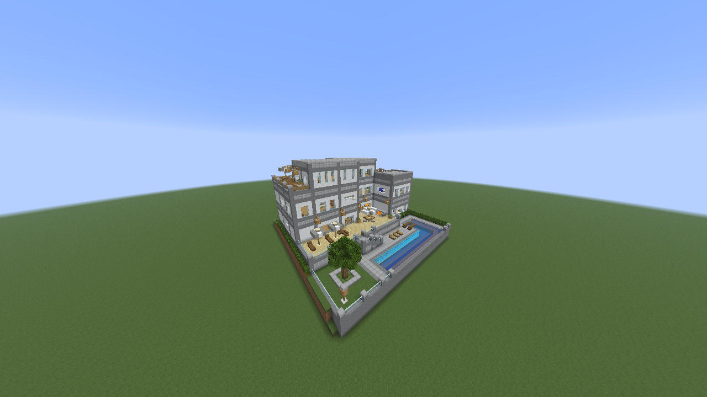
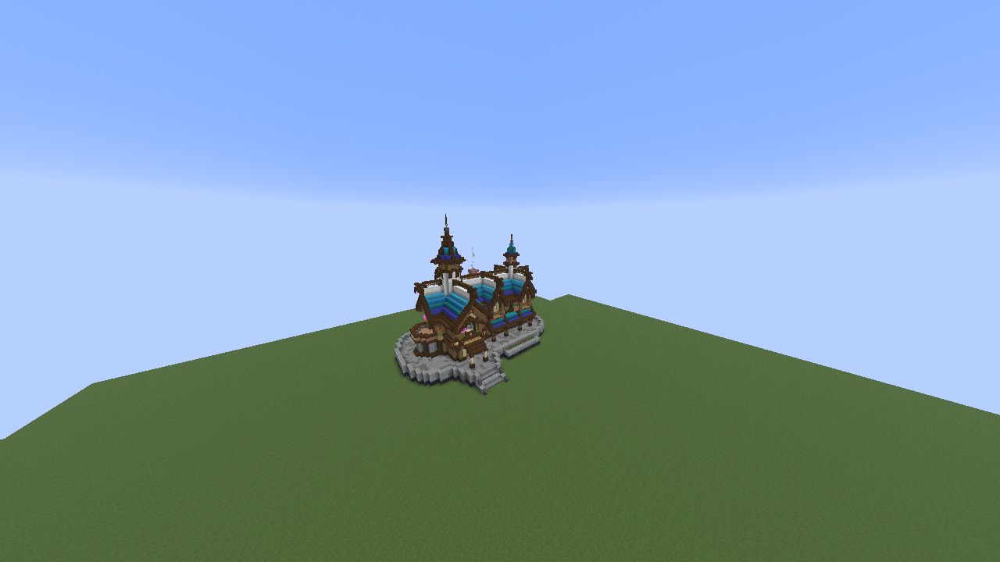
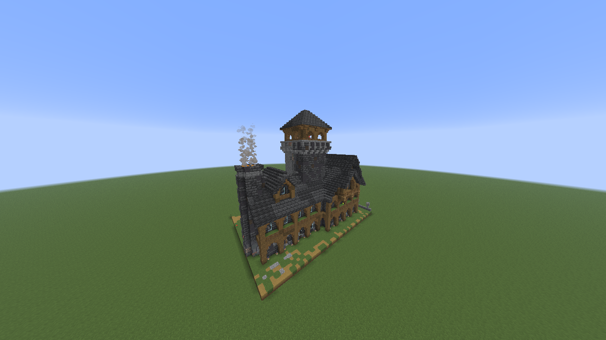
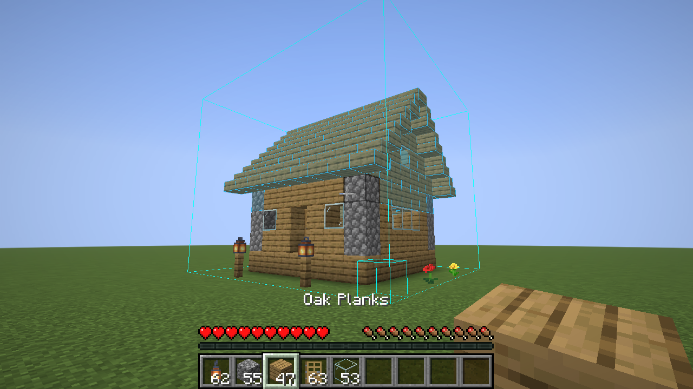
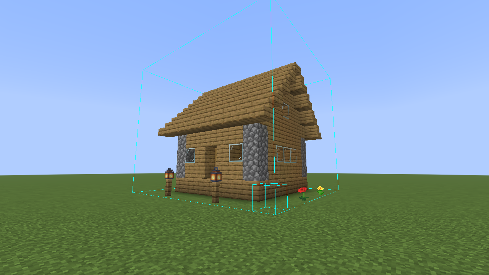
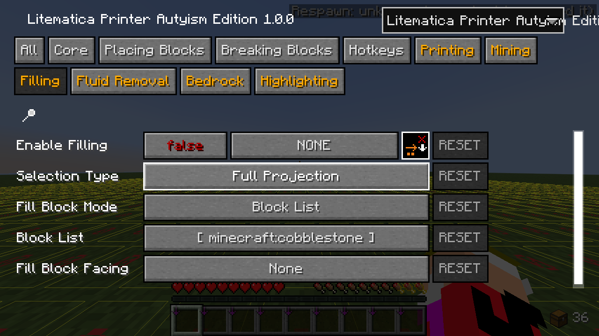
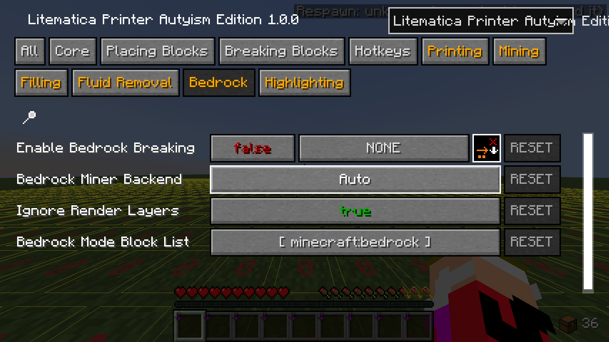
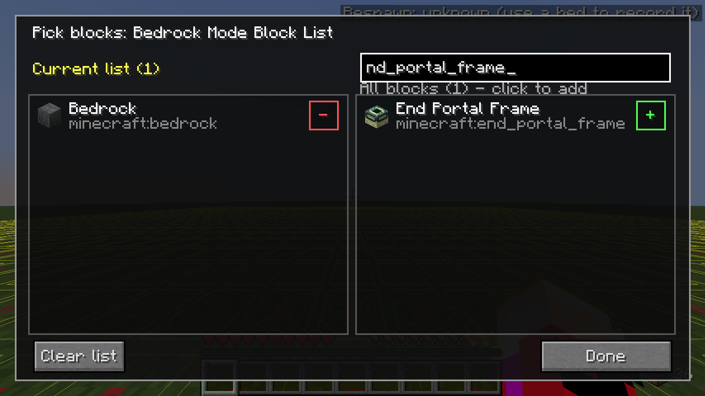

<h1 align="center">Litematica Printer Autyism Edition</h1>

适用于 Minecraft 1.21.11 的独立投影打印机：从最底层开始往上打印，红石、铁轨和服务器延迟都处理得更稳。

[English](README.md) | **简体中文**

  

Litematica Printer Autyism Edition（游戏内中文名“投影打印机 Autyism 版”）会自动把 [Litematica](https://modrinth.com/mod/litematica) 投影里的方块放到你身边。除了打印，它还能填充区域、排掉水和岩浆、挖空选区，以及把基岩交给破基岩模组去破。

它是独立模组（不是插件），基于 BiliXWhite 和 water2004 两个 Litematica Printer 分支，重点改进了“放出来的东西和投影一致”，在有延迟的真实服务器上也一样。它会替代其他投影打印机，不要和它们一起装。

## 功能

### 本版本的新内容

和它所基于的 1.21.11 版打印机相比，本版本新增或重做了：

- 从下往上的分层打印、最大 4096 的工作半径，以及单人世界自动调高触及距离。
- 使用容器时暂停，去箱子里拿材料不会再导致放错方块。
- 修正门（门轴）、藤蔓、拉杆、按钮和大箱子的放置，告示牌可以贴着告示牌放；活塞、侦测器等对朝向敏感的方块会等服务器确认转头后再放。
- 铁轨安全放置；音符盒、中继器等红石元件的调整每点一下都等服务器确认。
- 关键操作等服务器确认，延迟或 Meteor 的 NoGhostBlocks 都不会导致同一格放两次；延迟检测在单人世界里也能正常工作。
- 通过 Advanced Shulkerboxes 从潜影盒补货；投影里的潜影盒只用内容物一致的来放。
- 内置自动换工具和工具耐久保护，挖掘支持秒破优先。
- 破基岩模式支持 LXYan2333 的 Fabric-Bedrock-Miner，可选择使用哪个破基岩模组，方块列表可编辑。
- 可选用桶打印水、岩浆和装满的炼药锅。
- 自动导入旧版投影打印机的设置。

### 打出来和投影一致

- **朝向正确。** 楼梯、活板门（上半 / 下半和朝向）、门（包括门轴左右和双开门）、拉杆、按钮、砂轮、藤蔓、发光地衣、梯子、告示牌、旗帜和头颅都按投影里的样子放。
- **门会等旁边的方块。** 决定门轴的左右邻居方块放好、并且客户端能看到之后才放门，游戏不会把门轴改到另一边。
- **等服务器真正转过头再放。** 服务器按“头部朝向”决定方向的方块（活塞、侦测器、发射器、投掷器、合成器、木桶、铁轨、拉杆、按钮、梯子），要等服务器确认转头之后才放。你的视角不会被转动。
- **需要支撑的方块先等支撑。** 火把、拉杆、按钮、藤蔓这类方块会等它要贴的方块放好再放，不会贴错面。沙子、沙砾、铁砧等下落方块会等下面放上正确的方块。
- **大箱子和潜影盒。** 大箱子的第二半等第一半出现后再放，两半能正常合并。投影里的潜影盒只用内容物与投影完全一致的潜影盒来放（空盒对空盒）；创造模式下直接生成带对应内容的潜影盒。
- **告示牌和可交互方块。** 在投影有告示牌的位置放告示牌时，正面文字直接从投影填入，不会弹出编辑界面。对着箱子、告示牌、按钮、音符盒等可交互方块放方块时会自动潜行，不会误开、误按。

### 红石和铁轨

- **侦测器安全放置。** 开启“侦测器安全放置”（默认开）时，只有不会误触发机器的侦测器才会放；放不了的就故意跳过。会被侦测器触发的活塞，也会等侦测器盯着的那个方块放好再放。
- **铁轨安全放置。** 每放一节铁轨之前，先按原版铁轨连接规则模拟一遍：只有这节会变成投影里的形状、不会把已经放好的铁轨拉歪、也不会因为没有支撑而掉落时才放。互相连着的一组铁轨会预先规划放置顺序。原版怎么排都放不对的铁轨会留空，绝不会先放错再敲掉。
- **可调方块一次点一下，等确认再点。** 音符盒调音、中继器调延迟、比较器切模式、木门 / 活板门 / 栅栏门的开关、拉杆的开关，每点一下都要等服务器确认上一下，延迟再高也不会点过头。
- **可叠加方块。** 蜡烛、海泡菜、雪层、花簇和双层台阶会补到投影里的数量。
- **从下往上。** 开着分层打印时，机器从底部开始搭，上层的活塞、侦测器不会比下面的部分先放。

### 大型建筑

- **分层打印，从下往上**（默认开）。只打印工作范围内最低的、还没完成的那一层，这层完成后才开始上一层。每层完成时会提示结果：全部放好，或者正确、状态错误、方块错误、缺失各有多少。如果某一层暂时完成不了（例如材料用完了），几秒后会先往上打，到顶后再回来补。
- **超大工作半径。** 半径最大可设到 4096。只扫描半径内的投影部分，整段都是空气的区块段直接跳过，所以半径本身不会增加工作量。实际能放多远仍受服务器触及距离限制；单人世界里打印机会把触及距离调高，最多到原版上限 64。
- **单人世界自动调高交互距离。** 允许作弊时，打印机会用 `/attribute` 指令把你的方块交互距离调到和工作半径一致（原版上限 64），并等指令生效后才开始。单人世界里打印机不会在游戏不接受的距离外工作。
- **进度显示。** 打开“显示工作状态”后，准星下方会显示进度条：范围内已放好的方块数、状态错误、方块错误和当前层。“缺失材料 HUD”（默认开）会列出打印机找不到的材料。

### 材料和背包

- **使用容器时暂停**（默认开）。从你右键箱子或其他有界面的方块、村民、马或运输矿车的那一刻起，直到界面关闭后稍等片刻，以及打开任何背包 / 容器界面期间，打印机都会暂停（所有模式）。去箱子里拿材料不会再导致放错方块。
- **潜影盒补货**（默认开）。某种材料用完时，打印机会在背包里找装着它的潜影盒，在后台打开（不会弹出界面）并把材料取出来。支持 Advanced Shulkerboxes 和 QuickShulker；装了 AxShulkers 插件的服务器把潜影盒来源改成“插件”。背包快满时，会先把暂时用不到的物品放回去，优先放进已经装着同种物品的潜影盒。
- **快捷栏处理。** 材料会被换到 Litematica 设置 *pickBlockableSlots* 允许的快捷栏格子里。每次开始打印时，打印机会和服务器重新同步当前选中的快捷栏格子，这样即使有模组拦截“重复”的切换格子包，也不会拿错物品。

### 挖掘、填充和破基岩

- **内置自动换工具。** 打印机要破坏方块前，会从整个背包里挑最快、并且能让方块掉落的工具。不需要 Tweakeroo，也不影响你自己手动挖。
- **工具耐久保护。** 要用的工具耐久只剩 10 点或更少时，打印机不会换个差的工具凑合，而是停止所有破坏，把手上换成不会损坏的物品并提示你。修好或换掉工具后，关一下再开打印机即可继续。
- **秒破优先。** 挖掘模式先挖所有能秒破的方块，挖不动的留到最后；走动后范围里又出现能秒破的，会重新优先。默认只在你有效率 V 工具并且有急迫 II 时启用。
- **填充。** 在 Litematica 选区内，把空气、流体和可覆盖的方块填成列表里的方块（默认圆石）或手上拿的方块。可以设置朝向，例如放上半砖。
- **排流体。** 在选区内往水和岩浆里放方块（默认沙子），默认包括流动的液体。
- **挖掘。** 挖掉选区内所有非液体方块，可以用白名单 / 黑名单，或者 Tweakeroo 的破坏限制列表。
- **破基岩。** 把选区内的基岩交给破基岩模组处理：Fabric-Bedrock-Miner（LXYan2333）、Bedrock Miner（bunnyi116）或 BlockMiner。“自动”会优先用 LXYan2333 的。末地传送门框架、强化深板岩等方块可以加进方块列表；使用 Fabric-Bedrock-Miner 或 Bedrock Miner 时，这些方块还会自动同步到该模组自己的允许列表。默认忽略 Litematica 的渲染层，处理整个选区。

### 流体

- **用桶打印流体（默认关）。** 打开“用桶打印流体”后，会用水桶 / 岩浆桶放投影里的水源和岩浆源，并给应该装满水、岩浆或细雪的炼药锅倒满。只有整片水体四周和下方的方块都打印好之后才放水，不会漏出去。生存模式每格水源消耗一个装满的桶。
- **破冰放水**（默认关）。经典的生存方法：放冰、敲掉冰得到水，再把含水方块放进水里。

### 延迟高的服务器

- **关键操作等服务器确认。** 打印机对某一格做了操作后，服务器回应之前不会再动这一格，所以延迟不会导致同一格放两次。这也让它能和“等服务器确认后才显示方块”的客户端模组一起用，例如 Meteor 的 NoGhostBlocks（防幽灵方块）。
- **小心换物品。** 生存模式下从背包里换物品时，会等之前的操作都被确认；一组物品快用完时，会等服务器发来的剩余数量。
- **延迟过大暂停。** “延迟检测”（默认开）在服务器大约一秒没有发来任何数据时暂停打印机，数据恢复后继续。单人世界里也有效。
- **能用时就用轻松放置协议。** 单人游戏或装了 Servux 的服务器上，新方块直接按投影的状态放，不需要转头；其他服务器改为发送视角。Carpet 的旧协议只有在 Litematica 设置里手动选择时才会用。
- **自动关闭。** 死亡或断开连接时自动关闭打印机（“自动关闭打印机”）。

### 其他

- 原木自动去皮、用活珊瑚代替失活珊瑚、堆肥桶自动填充、骨粉催熟农作物、破坏错误 / 多余方块、跳过列表和覆盖列表、方块高亮、数据包放置和挖掘，以及可选的工作范围形状和遍历顺序。
- 方块列表可以填方块 ID（`minecraft:stone`）、当前语言的名称、标签（`#minecraft:logs`）、包含匹配（`带釉陶瓦,c`），也支持拼音（全拼和首字母）。设置界面的搜索框同样支持拼音。
- 第一次启动时会自动导入旧版投影打印机（BiliXWhite 或 water2004 版）的设置。
- 同时装了 Autyism 的投影增强（ALE）时，每个方块列表都会多一个“选择方块…”按钮，可以用图形界面挑选方块。

## 截图

带泳池和内饰的别墅，用分层打印打出。

打印机打出的中世纪风格旅店（带内饰）。

打印机打出的木结构庄园。

生存模式下打印到一半：墙已经放好，屋顶还是投影的预览。

打印机打完后的同一间小木屋。每个方块都和投影一致，包括楼梯朝向、门和灯笼。

设置界面。每种模式都有自己的分页，这里是“填充”分页。

“破基岩”分页：选择使用哪个破基岩模组、要破哪些方块。

装了 ALE 后，方块列表可以用图形界面选择方块。这里正在把末地传送门框架加进破基岩列表。

## 使用方法

### 默认按键

| 操作 | 默认按键 | 在哪里修改 |
|---|---|---|
| 开关打印机（“工作开关”） | Caps Lock | 打印机设置 → 快捷键 |
| 打开打印机设置 | Z + Y（按住 Z 再按 Y） | 打印机设置 → 快捷键 |
| 关闭全部模式（关闭所有模式和工作开关） | 左 Ctrl + G | 打印机设置 → 快捷键 |
| 轮换模式（打印 → 挖掘 → 填充 → 排流体 → 破基岩，每次只开一个） | 未设置 | 打印机设置 → 快捷键 |
| 单独开关某个模式、分层打印或破冰放水 | 未设置 | 该选项所在分页里、选项旁边的快捷键按钮 |

“工作开关”是总开关：它开着的时候，所有“启用”选项打开了的模式都会工作。每次切换时快捷栏上方都会提示。“轮换模式”只切换模式，不会打开工作开关。

### 打开设置界面

- 在世界里按 **Z + Y**。
- 打开 Litematica 主菜单（默认 **M**），点 **打印机设置**。
- 在 Mod Menu 里选中本模组，点设置按钮。
- 在任意 MaLiLib 设置界面右上角的模组下拉框里切换过来。

### 指令

本模组不添加任何指令。单人世界允许作弊时，“单人世界自动调高交互距离”会在需要时替你执行原版的 `/attribute` 指令。

### 打印投影

1. 像平常一样用 Litematica 加载并放置投影。
2. 打开打印机设置，在 **打印** 分页把 **启用打印** 设为 `true`。这一项默认是关的，只需要设一次。
3. 带上材料，或者装着材料的潜影盒。创造模式下打印机会直接从创造物品栏取。
4. 站到建筑附近，按 **Caps Lock**。打印机会在触及范围内从最低层开始放方块。它不会帮你移动，需要沿着建筑走，或者调大工作半径。
5. 再按一次 **Caps Lock** 停止。想看进度条，就在 **核心** 分页打开 **显示工作状态**。

打印机遵循 Litematica 的渲染层，所以可以用 Litematica 的图层控制只打印某几层。

### 站在原地打印大型建筑

1. 在允许作弊的单人世界里，把 **工作半径**（核心分页）设成例如 32 或 64。打印机会自动调高你的触及距离，最多到 64。
2. 保持 **分层打印** 开启，站在建筑中间附近按 Caps Lock。它会从最底层一层一层往上搭，每层完成都会提示。
3. 在服务器上，半径受服务器的触及距离限制。除非服务器允许更远，否则把工作半径保持为 `0`（即你正常的触及距离）。

### 填充、排流体或挖掘一片区域

1. 用 Litematica 的选区工具框选区域。
2. 打开对应的分页（**填充**、**排流体** 或 **挖掘**），检查方块列表，并把该模式的 **启用** 选项设为 `true`。如果只想用这个模式，把“启用打印”关掉。
3. 按 Caps Lock。

### 破基岩

1. 装一个受支持的破基岩模组，并在生存模式下使用（创造模式不能用破基岩模式）。
2. 用 Litematica 的选区工具框选区域。
3. 在 **破基岩** 分页把 **启用破基岩** 设为 `true`。“破基岩模组”保持“自动”，或者手动选择。
4. 按 Caps Lock。破基岩模式运行期间打印机会打开破基岩模组，结束后恢复原状。

## 设置

下表的名称与游戏内显示一致。设置界面有一个“全部”分页，其余每个主题一个分页。

### 核心

| 选项 | 默认值 | 作用 |
|---|---|---|
| 工作开关 | 关（Caps Lock） | 所有模式的总开关。 |
| 工作半径 | 0 | 打印机以你为中心的工作范围，最大 4096。`0` 表示使用你正常的触及距离。 |
| 单人世界自动调高交互距离 | 开 | 允许作弊时，把方块交互距离调到工作半径（最大 64）。 |
| 单人世界限制在交互距离内 | 开 | 单人世界里不会在游戏不接受的距离外工作。 |
| 使用容器时暂停 | 开 | 打开或使用容器、背包界面时暂停。 |
| 显示工作状态 | 关 | 在准星下方显示进度。 |
| 缺失材料 HUD | 开 | 在 Litematica 信息 HUD 区域列出缺少的材料。 |
| 延迟检测 / 延迟检测最大值 | 开 / 20 tick | 服务器这么久没有发来数据时暂停。 |
| 工作范围形状 | 球体 | 工作范围的形状：球体、正方体或八面体。 |
| 遍历顺序 | X→Z→Y | 检查方块的顺序，每个轴都可以反向。 |
| 按方块类型分类 | 关 | 每轮只处理一种方块，减少换物品。 |
| 迭代时长限制 | 8 毫秒 | 每 tick 用来检查方块的最长时间。 |
| 自动关闭打印机 | 开 | 死亡或断开连接时关闭工作开关。 |

### 放置方块

| 选项 | 默认值 | 作用 |
|---|---|---|
| 放置间隔时间 | 1 tick | 每轮放置之间隔多少 tick。打印红石机器时不建议设为 0。 |
| 每刻放置方块数 | 1 | 每轮放几个方块，`0` 表示不限制。 |
| 放置冷却时间 | 3 tick | 同一格重试前等多久，不要设为 0。 |
| 放置使用数据包 | 关 | 放置时不做客户端预测，在严格的服务器上可能有帮助。 |
| 下落方块检查 | 开 | 沙子、沙砾、铁砧等会等下面的方块放对再放。 |

### 打印

| 选项 | 默认值 | 作用 |
|---|---|---|
| 启用打印 | 关 | 打开打印模式。 |
| 分层打印（从下往上） | 开 | 先打印最低的未完成层。 |
| 选区类型 | 可见层 | “玩家下方 / 玩家上方”只处理你脚下以下或以上的部分；Litematica 的渲染层始终生效。 |
| 使用轻松放置协议 | 开 | 服务器支持时使用 Litematica 的轻松放置协议（单人游戏、装了 Servux 的服务器）。 |
| 侦测器安全放置 | 开 | 跳过会误触发机器的侦测器。 |
| 铁轨安全放置 | 开 | 只放会变成正确形状的铁轨。 |
| 音符盒自动调音 | 开 | 把音符盒调到投影里的音高。 |
| 用桶打印流体 | 关 | 用桶放水源、岩浆源，并倒满炼药锅。 |
| 破冰放水 | 关 | 放冰再敲掉来得到水（仅生存模式）。 |
| 凭空放置 | 开 | 没有可点击的相邻方块也能放；需要支撑的方块仍会等支撑。 |
| 覆盖打印 - 开关 / 列表 | 开 / 雪、水、岩浆、气泡柱、矮草丛 | 列表里的方块直接被替换。 |
| 跳过放置 - 开关 / 列表 | 关 / 空 | 列表里的方块永远不放。 |
| 跳过含水方块 | 关 | 跳过投影里含水的方块。 |
| 破坏错误方块 / 破坏多余方块 | 关 | 破坏与投影不符的方块，或投影里没有的方块。 |
| 破坏错误状态方块(实验性) | 关 | 破坏方块对了但状态不对、又无法通过点击修正的方块。 |
| 始终潜行 | 关 | 每次放置都潜行。 |
| 使用快捷潜影盒 | 开 | 从背包里的潜影盒补充缺少的材料。 |
| 潜影盒来源 | 模组（Quick Shulker） | “模组”：使用已安装的 Advanced Shulkerboxes 或 QuickShulker；“插件”：装了 AxShulkers 的服务器。 |
| 背包满时有序放回潜影盒 | 开 | 背包满时把物品放回潜影盒。 |

### 破坏方块

| 选项 | 默认值 | 作用 |
|---|---|---|
| 自动切换工具 | 开 | 破坏前从背包里选最合适的工具。 |
| 工具耐久保护 / 耐久保护阈值 | 开 / 10 | 工具耐久不高于该值时停止破坏，而不是继续用它。 |
| 检查方块硬度 | 开 | 跳过无法破坏的方块。 |
| 挖掘进度阈值 | 100% | 挖到这个进度（70%~100%）就算挖完。原版服务器在 70% 就认可，但反作弊不一定。 |
| 即时挖掘 | 关 | 一 tick 的挖掘进度达到上面的阈值时直接破坏；阈值低于 100% 时才有作用。 |
| 破坏间隔时间 / 每刻破坏方块数 / 挖掘冷却时间 | 1 tick / 1 / 3 tick | 破坏速度限制。 |
| 挖掘限制规则来源 / 自定义限制模式 | 自定义 / 无限制 | 打印机破坏方块时用的白名单、黑名单，或 Tweakeroo 的列表。 |

### 挖掘、填充、排流体

| 选项 | 默认值 | 作用 |
|---|---|---|
| 启用挖掘 | 关 | 挖掉选区内的方块。 |
| 仅在效率V+急迫II时启用秒破优先 | 开 | 只在有效率 V 和急迫 II 时秒破优先；关闭则始终秒破优先。 |
| 启用填充 | 关 | 填充选区。 |
| 填充方块模式 / 方块列表 | 方块列表 / 圆石 | 用列表里的方块填充，或用手上拿的方块（“手持物品”）。 |
| 填充方块朝向 | 无 | 填充方块的朝向，例如上半砖或下半砖。 |
| 启用排流体 | 关 | 替换选区内的流体。 |
| 包含流动液体 | 开 | 流动的水和岩浆也会被填掉。 |
| 流体填充方块列表 / 流体列表 | 沙子 / 水、岩浆 | 用来填的方块，以及要排掉的流体。 |

### 破基岩

| 选项 | 默认值 | 作用 |
|---|---|---|
| 启用破基岩 | 关 | 把选区内的方块交给破基岩模组。 |
| 破基岩模组 | 自动 | 使用哪个模组。自动：先 Fabric-Bedrock-Miner（LXYan2333），其次 Bedrock Miner（bunnyi116），再其次 BlockMiner。 |
| 忽略渲染层 | 开 | 处理整个选区，不受 Litematica 渲染层限制。 |
| 破基岩方块列表 | `minecraft:bedrock` | 要破的方块，也会加入 Fabric-Bedrock-Miner 或 Bedrock Miner 的允许列表。 |

### 高亮显示

| 选项 | 默认值 | 作用 |
|---|---|---|
| 启用方块高亮 | 关 | 用轮廓标出打印机放置（白）、调整（绿）、破坏（红）或放置失败（灰）的方块。 |
| 高亮样式 / 渐隐时长 / 透视模式 | 轮廓 / 0.5 秒 / 关 | 高亮的外观，颜色可以自定义。 |

## 前置要求

| | 版本 | 说明 |
|---|---|---|
| Minecraft | 1.21.11 | Java 版 |
| Java | 21 | |
| Fabric Loader | 0.17.0 或更高 | |
| [Fabric API](https://modrinth.com/mod/fabric-api) | 1.21.11 对应版本 | 必需 |
| [MaLiLib](https://modrinth.com/mod/malilib) | 0.27.0 或更高 | 必需 |
| [Litematica](https://modrinth.com/mod/litematica) | 0.26.0 或更高 | 必需 |

可选：

- [Mod Menu](https://modrinth.com/mod/modmenu)：在模组列表里提供设置按钮。
- Autyism 的投影增强（ALE）：所有方块列表都能用图形界面选择方块。
- [Tweakeroo](https://modrinth.com/mod/tweakeroo)：打印机可以使用它的破坏限制列表。
- [Advanced Shulkerboxes](https://modrinth.com/mod/advanced-shulkerboxes) 或 QuickShulker（模组 ID `quickshulker`）：潜影盒补货。客户端和服务器都要装。
- AxShulkers（服务器插件）：在使用它的服务器上补货。
- 服务器装 [Servux](https://modrinth.com/mod/servux)：多人游戏也能用轻松放置协议。
- 破基岩模式需要一个破基岩模组：[Fabric-Bedrock-Miner](https://modrinth.com/mod/fabric-bedrock-miner)（LXYan2333）、[Bedrock Miner](https://modrinth.com/mod/next-fabric-bedrock-miner)（bunnyi116）或 [BlockMiner](https://github.com/z7087/blockminer)。

**安装端：** 仅客户端。服务器不需要装本模组，只有上面的部分可选联动需要服务器端。

## 兼容性

- **其他打印机：** 不要和其他 Litematica Printer（BiliXWhite 版、water2004 版、aleksilassila 原版）同时安装。和它们同时安装时游戏会拒绝启动（模组 ID 为 `litematica-printer` 或 `litematica_printer`）。
- **Sodium 和 Iris：** 没有已知问题，打印机在同时装了两者的整合包里测试过。
- **Tweakeroo：** 可以一起用。打印机的自动换工具是自己实现的，不依赖 Tweakeroo 的换工具功能。
- **Meteor Client：** 开着 NoGhostBlocks（防幽灵方块）时打印正常。但 Bedrock Miner（bunnyi116）在 NoGhostBlocks 开着时什么都破不掉，打印机会给出提示；请关掉 NoGhostBlocks，或改用 Fabric-Bedrock-Miner（LXYan2333）。
- **Carpet：** Carpet 的轻松放置协议（V2）只有在 Litematica 设置里手动选择 V2 时才会用，因为它需要服务器打开 `accurateBlockPlacement` 规则。
- **ALE：** 可选，两个模组互不依赖。

## 安装

1. 为 Minecraft 1.21.11 安装 Fabric Loader 0.17.0 或更高版本（Java 21）。
2. 下载 1.21.11 对应的 Fabric API、MaLiLib、Litematica 以及本模组。
3. 把所有 jar 文件放进 `mods` 文件夹。
4. 删掉文件夹里其他的 Litematica Printer jar。
5. 启动游戏，进入世界，按 **Z + Y** 打开设置。

## 常见问题

**按了 Caps Lock 没反应。**

确认 **启用打印** 是 `true`（默认是关的），投影已放置并且在工作半径内，Litematica 的渲染层也显示着你所在的那部分。打开容器或背包界面时、服务器卡顿时打印机也会暂停。缺材料时，缺失材料 HUD 会列出来。

**有些侦测器或铁轨没放，是 bug 吗？**

不是。会误触发机器的侦测器、放不成正确形状的铁轨，都是故意留空的。等机器其他部分完成后手动补上即可。可以关掉“侦测器安全放置”，但这样侦测器可能在建造过程中触发你的机器。

**能不能站着不动打印大型建筑？**

在允许作弊的单人世界里可以：调大工作半径，保持分层打印开启。在服务器上只能在服务器允许的触及距离内打印。

**单人世界打印完后，我的触及距离还是很远。**

“单人世界自动调高交互距离”用原版 `/attribute` 指令修改了你在这个世界里的方块交互距离，这个值会一直保留。想恢复的话执行 `/attribute @s minecraft:block_interaction_range base set 4.5`。不想要这个功能就把该选项关掉。

**能在服务器上用吗？**

本模组只装在客户端，服务器不需要安装，但很多服务器不允许使用打印机，请先看清规则。打印机会发送自己的视角并快速放置方块，反作弊可能会注意到。如果放置经常被拒绝，调大“放置间隔时间”，“每刻放置方块数”保持 1，“工作半径”保持 0。服务器装了 Servux 时，大部分转头都可以省掉。

**为什么只用了快捷栏的部分格子？**

打印机使用 Litematica 设置 *pickBlockableSlots* 里列出的格子（默认 1~5）。如果这个列表是空的，它就无法从背包里拿物品。

**水没有被打印。**

“用桶打印流体”默认是关的。打开它，并带上装满的桶。

**破基岩模式没反应。**

破基岩模式只能在生存模式下用，需要装受支持的破基岩模组，并且使用 Litematica 的选区（不是投影）。另见“兼容性”里关于 Meteor 的说明。

发现 bug？欢迎提交 issue：https://github.com/Autyism/litematica-printer-autyism/issues

## 已知限制

- **故意留空：** 会误触发机器的侦测器（开着侦测器安全放置时）、原版怎么放都放不成正确形状的铁轨（例如上下紧贴的一串上坡动力铁轨），以及依赖这些方块的东西。
- **不会打印：** 实体（物品展示框、盔甲架、画、矿车）、睡莲、气泡柱、活塞头，以及流动的水和岩浆（它们由水源、岩浆源自然产生）。含水方块会被放成不含水的，除非开启“破冰放水”（仅生存模式）。
- **由游戏决定的状态：** 红石充能、亮灭、树叶距离、树苗生长阶段、阳光探测器的信号强度等不会被还原，在进度显示里可能算作“状态错误”。
- **用桶打印流体：** 打印机需要能看到相邻方块的某个面，所以有些水源要等你走动后才会放。如果水源还没放就被上一层盖住了，需要手动放。
- **多人游戏：** 工作半径受服务器触及距离限制；自动调高交互距离只在单人世界有效；潜影盒补货需要服务器装对应的模组或插件；轻松放置协议需要服务器装 Servux。
- **生存模式材料种类多：** 材料种类比可用的快捷栏格子多时，在延迟高的服务器上打印会变慢，因为每次从背包换物品都要等服务器确认。
- **Bedrock Miner（bunnyi116）和 Meteor 的 NoGhostBlocks** 不能同时使用。
- **翻译：** 英文和简体中文是完整的。繁体中文、文言文和俄语里，较新的选项会显示简体中文或英文。

## 致谢

本模组延续了以下作者的工作：

- [aleksilassila](https://github.com/aleksilassila/litematica-printer)：最初的 Litematica Printer
- [zhaixianyu](https://github.com/zhaixianyu/litematica-printer)：原版的二改分支
- [BiliXWhite](https://github.com/BiliXWhite/litematica-printer)（BlinkWhite）：本版本所基于的分支
- [water2004](https://github.com/water2004/litematica-printer)：其修复已合并进本版本
- [bunnyi116](https://github.com/bunnyi116)：上游贡献者，Bedrock Miner 的作者
- 以及这些项目中致谢的所有人，包括 Rofumer、Cjsah、EnderPhantomWing 和 MoRanpcy

同样感谢 masa（Litematica、MaLiLib、Tweakeroo）、LXYan2333（Fabric-Bedrock-Miner）、z7087（BlockMiner）、Max Henkel（Advanced Shulkerboxes）、kyrptonaught 和 MoRanpcy（QuickShulker），以及 pinyin4j（已内置，用于拼音搜索）。模组图标来自 BiliXWhite 分支。

## 许可证

GNU Affero 通用公共许可证 v3.0（[AGPL-3.0](LICENSE.md)），继承自上游 Litematica Printer 项目：你可以使用、分享和修改本模组，但你的版本必须以同样的许可证公开源代码。
